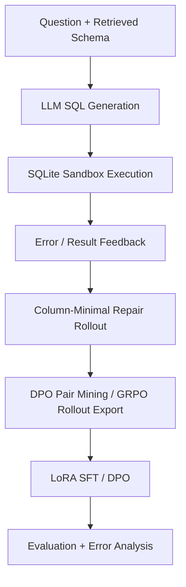

# Execution-Guided Text-to-SQL Post-Training

This project builds a short-horizon Text-to-SQL post-training pipeline that turns one-shot SQL generation into an environment interaction task:

1. Generate SQL from `question + retrieved schema`.
2. Execute the SQL inside a read-only SQLite sandbox.
3. Feed SQLite errors or result-mismatch feedback back to the model.
4. Mine preference pairs from successful repairs.
5. Train with LoRA SFT or DPO.

The pipeline writes trajectories, GRPO-style rollout records, DPO pairs, and reward/metric summaries.

## Pipeline Overview



## Core Contributions

- **Execution-Guided Self-Repair**: turns one-shot SQL generation into a short-horizon environment interaction task: generate SQL, execute it, read feedback, then repair.
- **Column-Minimal Repair Feedback**: diagnoses invalid columns, alias ownership, candidate owner tables, available schema columns, and asks the model to remove unnecessary joins when a minimal SQL is enough.
- **Preference Mining for DPO**: mines same-prompt first-turn pairs, same-feedback repair pairs, gold fallback pairs, and synthetic hard negatives from execution-verified rollouts.
- **DPO Pair Quality Dashboard**: reports reward margin, SQL edit distance, duplicate rate, pair-type distribution, chosen executable rate, and hard-negative ratio before/after filtering.
- **Verifier-Aware Error Routing**: separates executor-visible errors, guarded errors, and external-verifier semantic errors so online repair and offline verified-failure repair are not mixed together.
- **Error Taxonomy Analysis**: shows the main bottleneck is not schema retrieval recall under top-k=6, but table-column ownership, join reasoning, and result grounding.

## What Is Implemented

- Spider/WikiSQL-style JSON or JSONL ingestion.
- SQLite read-only execution sandbox with timeout.
- Baseline one-shot mode via `--max_turns 1`.
- Multi-turn self-repair rollout: `SQL -> execute -> feedback -> revised SQL`.
- Repair feedback detail switch:
  - `--feedback_detail basic`: legacy SQLite error/result-status feedback.
  - `--feedback_detail column`: column-aware diagnostics with invalid identifiers, alias/table ownership hints, selected-table columns, and row-count/sample mismatch details.
  - `--feedback_detail minimal`: column-aware feedback plus a minimal-SQL repair constraint that asks the model to remove unnecessary joins instead of only patching aliases.
- Schema retrieval modes: `retrieved` token-overlap baseline, `bm25`, and `bm25_fk` with foreign-key expansion.
- Execution-guided DPO pair mining:
  - `chosen`: repaired SQL that executes to the gold result, or gold SQL when enabled.
  - `rejected`: first-turn wrong SQL.
  - If a repair turn samples both correct and failed repairs under the same `question + schema + previous SQL + execution feedback` prompt, the pipeline prefers a cleaner `repair_correct_vs_repair_failed` pair.
- Preference-pair filtering and balancing:
  - per-input and per-pair-type caps to prevent synthetic pairs from dominating.
  - optional reward-margin filtering with `--min_reward_margin`.
  - optional SQL token edit-distance filtering with `--max_sql_edit_distance_ratio`.
- Rule reward logging:
  - `1.0` if correct in one turn.
  - `0.7 - 0.1 * (turn - 2)` if self-corrected.
  - `0.2` if executable but result is wrong.
  - `-0.2` for syntax/schema errors before the final turn.
  - `-0.5` if still wrong after max turns.
- Metrics:
  - first-turn example accuracy
  - final example execution accuracy
  - first-turn candidate execution accuracy
  - candidate execution accuracy
  - executable rate
  - schema valid rate
  - repair success rate

When `--num_samples > 1`, example-level metrics answer "did this question get at least one correct SQL?", while candidate-level metrics answer "what fraction of generated SQL candidates were correct?".

## Quick Smoke Test

Run the entire mock pipeline with one command. This does not require a local LLM and is intended for smoke testing the full data path:

```bash
python3 scripts/run_demo_pipeline.py
```

Or run the same steps manually.

Create a tiny Spider-style demo database:

```bash
python3 scripts/make_demo_dataset.py
```

Run a no-download mock rollout. The mock generator intentionally emits a bad first SQL and then repairs to the gold SQL, so the full execution-feedback and DPO construction path is exercised:

```bash
python3 text2sql_trajectory_builder.py \
  --dataset_path data/demo/dev.jsonl \
  --db_root data/demo/database \
  --output_dir outputs/demo_mock \
  --generator mock \
  --max_turns 3 \
  --use_gold_when_failed
```

Inspect:

```bash
cat outputs/demo_mock/summary.json
head -n 1 outputs/demo_mock/trajectories.jsonl
cat outputs/demo_mock/dpo_pairs.json
```

## Reproducible Experiment Scripts

The `experiments/` directory contains shell entry points for a compact, reproducible delivery package. By default, they assume:

- `SPIDER_ROOT=data/spider_data`
- `MODEL_PATH=models/Qwen2.5-Coder-3B-Instruct`
- `OUTPUT_ROOT=outputs`
- `TRAIN_LIMIT=1000`

Override these with environment variables when needed:

```bash
SPIDER_ROOT=/path/to/spider \
MODEL_PATH=models/Qwen2.5-Coder-3B-Instruct \
TRAIN_LIMIT=1000 \
bash experiments/03_mine_dpo_pairs.sh
```

Recommended order:

```bash
bash experiments/00_make_demo.sh
bash experiments/01_eval_base_oneshot.sh
bash experiments/02_eval_base_repair.sh
bash experiments/03_mine_dpo_pairs.sh
bash experiments/04_train_dpo.sh
bash experiments/05_eval_dpo_repair.sh
bash experiments/06_compare.sh
```

Small artifacts can be copied into `outputs_key/`, while large trajectories, adapters, and raw rollouts should stay in `outputs/` or external storage.

## Day 1: Baseline Evaluation

For a real local model:

```bash
python3 text2sql_trajectory_builder.py \
  --dataset_path /path/to/spider/dev.json \
  --db_root /path/to/spider/database \
  --output_dir outputs/baseline \
  --generator hf \
  --model_path /path/to/model \
  --max_turns 1 \
  --schema_mode retrieved \
  --top_k_tables 6
```

Use `summary.json` for execution accuracy, repair success, and executable rate.

Schema retrieval ablations:

```bash
python3 text2sql_trajectory_builder.py \
  --dataset_path "$SPIDER_ROOT/dev.json" \
  --db_root "$SPIDER_ROOT/database" \
  --output_dir outputs/spider_200_base_oneshot_bm25_fk \
  --generator hf \
  --model_path models/Qwen2.5-Coder-3B-Instruct \
  --limit 200 \
  --max_turns 1 \
  --num_samples 1 \
  --temperature 0 \
  --schema_mode bm25_fk \
  --top_k_tables 6 \
  --fk_hops 1 \
  --use_gold_when_failed
```

### Recommended Local Base Models

Use a text or code causal language model, not a vision-language checkpoint. Good practical choices:

- Best quality: Qwen2.5-Coder-7B-Instruct
- Best short-iteration choice: Qwen2.5-Coder-3B-Instruct
- General baseline: Qwen2.5-3B/7B-Instruct
- Use 1.5B only for debugging or very small GPUs

Download with the Hugging Face mirror:

```bash
export HF_ENDPOINT=https://hf-mirror.com

python3 scripts/download_hf_model.py \
  --repo_id Qwen/Qwen2.5-Coder-3B-Instruct \
  --local_dir models/Qwen2.5-Coder-3B-Instruct

python3 scripts/download_hf_model.py \
  --repo_id Qwen/Qwen2.5-Coder-7B-Instruct \
  --local_dir models/Qwen2.5-Coder-7B-Instruct

python3 scripts/download_hf_model.py \
  --repo_id Qwen/Qwen2.5-3B-Instruct \
  --local_dir models/Qwen2.5-3B-Instruct
```

Pass the local Hugging Face model directory after download:

```bash
python3 text2sql_trajectory_builder.py \
  --dataset_path data/demo/dev.jsonl \
  --db_root data/demo/database \
  --output_dir outputs/local_model_demo \
  --generator hf \
  --model_path models/Qwen2.5-Coder-3B-Instruct \
  --max_turns 3
```

## Day 2: Self-Repair Rollouts And DPO Mining

```bash
python3 text2sql_trajectory_builder.py \
  --dataset_path /path/to/spider/dev.json \
  --db_root /path/to/spider/database \
  --output_dir outputs/repair_rollouts \
  --generator hf \
  --model_path /path/to/model \
  --max_turns 3 \
  --feedback_mode result_status \
  --feedback_detail basic \
  --num_samples 1 \
  --use_gold_when_failed
```

Important outputs:

- `trajectories.jsonl`: per-example SQL attempts, execution status, errors, rewards.
- `dpo_pairs.json`: prompt/chosen/rejected triples.
- `grpo_rollouts.jsonl`: prompt, completions, and scalar rewards.

When `--num_samples > 1`, repair turns can produce same-prompt repair-policy DPO pairs:

```text
prompt   = question + schema + previous_sql + execution_feedback
chosen   = repair candidate that executes to the gold result
rejected = repair candidate from the same repair prompt that still fails
pair_type = repair_correct_vs_repair_failed
```

If no same-prompt repair pair exists, the builder falls back to the older natural pairs such as `self_repair_success_vs_failed_attempt`, `first_turn_correct_sample_vs_failed_sample`, or `gold_vs_failed_attempt`.

Column-aware repair feedback keeps the same rollout path but adds schema-grounded repair hints:

```bash
python3 text2sql_trajectory_builder.py \
  --dataset_path /path/to/spider/dev.json \
  --db_root /path/to/spider/database \
  --output_dir outputs/repair_rollouts_column \
  --generator hf \
  --model_path /path/to/model \
  --max_turns 3 \
  --feedback_mode result_status \
  --feedback_detail column \
  --num_samples 1 \
  --use_gold_when_failed
```

## Day 3: LoRA SFT Or DPO

Install training dependencies:

```bash
pip install -r requirements.txt
```

LoRA SFT from successful/gold SQL:

```bash
python3 training/train_lora_sft.py \
  --model_name_or_path /path/to/model \
  --trajectories outputs/repair_rollouts/trajectories.jsonl \
  --dpo_pairs outputs/repair_rollouts/dpo_pairs.json \
  --output_dir outputs/lora_sft
```

LoRA DPO from execution-guided preference pairs:

```bash
python3 training/train_lora_dpo.py \
  --model_name_or_path /path/to/model \
  --dpo_pairs outputs/repair_rollouts/dpo_pairs.json \
  --output_dir outputs/lora_dpo
```

Add `--bf16` on supported GPUs.

Evaluate a trained LoRA adapter with the same rollout script:

```bash
python3 text2sql_trajectory_builder.py \
  --dataset_path /path/to/spider/dev.json \
  --db_root /path/to/spider/database \
  --output_dir outputs/eval_dpo_adapter \
  --generator hf \
  --model_path models/Qwen2.5-Coder-3B-Instruct \
  --adapter_path outputs/dpo_qwen25_coder_3b_spider200/adapter \
  --limit 200 \
  --max_turns 1 \
  --num_samples 1 \
  --temperature 0 \
  --schema_mode retrieved \
  --top_k_tables 6 \
  --use_gold_when_failed
```

## Dataset Format

The bundled demo dataset is enough for smoke testing and does not require downloading anything:

```bash
python3 scripts/make_demo_dataset.py
```

For meaningful experiments, download a real Text-to-SQL benchmark locally. Spider is the best fit for this pipeline because it already includes multiple SQLite databases and gold SQL. WikiSQL can also be used, but you need to provide or convert table files into SQLite databases so each example resolves to a `db_path` or `db_id`.

Each example can be Spider-style:

```json
{
  "db_id": "company",
  "question": "How many employees work in Sales?",
  "query": "SELECT COUNT(*) FROM employees ..."
}
```

Supported aliases:

- question: `question`, `utterance`, `nl`
- gold SQL: `query`, `sql`, `gold_sql`
- database: `db_path`, `database_path`, `sqlite_path`, or `db_id` plus `--db_root`

For Spider layout, the script searches:

- `{db_root}/{db_id}/{db_id}.sqlite`
- `{db_root}/{db_id}.sqlite`

## Experiment Results

Column-Minimal Repair (CM Repair) means column-aware execution feedback plus the minimal-SQL repair constraint implemented by `--feedback_detail minimal`.

Main evaluation uses Qwen2.5-Coder-3B-Instruct with greedy decoding. Preference data is mined from Spider `train_spider.json`; Spider dev full 1034 examples are used only for final clean-split evaluation.

### Clean-Split Main Results

| Run | First-turn EX | Final EX | Repair SR | Executable |
| --- | ---: | ---: | ---: | ---: |
| Base-OneShot | 57.56% | 57.56% | / | 83.43% |
| Base + CM Repair | 57.56% | 68.90% | 26.71% | 81.20% |
| SFT-OneShot | 61.92% | 61.92% | / | 82.54% |
| SFT + CM Repair | 61.92% | 71.41% | 24.94% | 82.54% |
| DPO-OneShot | 62.11% | 62.11% | / | 82.02% |
| DPO + CM Repair | 62.11% | 71.80% | 25.58% | 82.02% |
| SFT+DPO-OneShot | 67.25% | 67.25% | / | 84.45% |
| SFT+DPO + CM Repair | 67.25% | 73.55% | 19.23% | 84.45% |

SFT and DPO both improve first-turn SQL generation over the base model, while CM Repair adds verified-failure correction on top. SFT+DPO gives the best clean-split result, suggesting that supervised SQL imitation and execution-guided preference optimization are complementary in this setting. DPO rows use the final synthetic-ratio-controlled Synth20 preference set with 701 filtered pairs: 557 natural rollout pairs and 144 synthetic hard negatives.

`Executable` is the percentage of generated SQL candidates that pass SQL parsing, schema checks, and SQLite execution without runtime errors. It measures execution stability, not whether the returned result matches the gold answer.

### Verified-Failure Setting

This project does not assume that an online system magically knows whether every SQL answer is semantically correct. Instead, it studies the verified-failure setting: after a verifier catches a failed SQL, the model uses execution feedback to repair it, and the verified failure trajectories are converted into preference data.

In deployment, the verifier can be a SQL executor for syntax/schema/runtime errors, plus business rules, tests, user feedback, result sanity checks, or an LLM judge for semantic failures. In Spider, gold execution results provide a controlled verifier for measuring repair and mining execution-guided preference pairs.

```text
pred SQL -> verifier/executor -> failure feedback -> repair SQL
                                  -> chosen/rejected preference pair
```

### DPO Data Engine

Preference data is mined from model-generated failures rather than only from static gold SQL. Natural rollout pairs are combined with synthetic hard negatives, then cleaned with reward-margin and SQL edit-distance filters.

| Pair Type | Purpose |
| --- | --- |
| `gold_vs_failed_attempt` | Use gold SQL as chosen when rollout fails after max turns. |
| `first_turn_correct_sample_vs_failed_sample` | Compare correct and failed first-turn candidates under the same prompt. |
| `self_repair_success_vs_failed_attempt` | Learn from verified repairs that fixed an initial failed SQL. |
| `repair_correct_vs_repair_failed` | Compare correct and failed repair candidates under the same feedback prompt. |
| `synthetic_wrong_column` / `synthetic_missing_join` / `synthetic_wrong_aggregation` | Add targeted hard negatives for column grounding, join reasoning, and aggregation errors. |

Filtering and balancing are used to avoid noisy preference pairs and synthetic-data distribution shift:

- `--min_reward_margin`: removes weak preferences.
- `--max_sql_edit_distance_ratio`: keeps chosen/rejected SQL structurally related.
- `--input_fraction_limits` and `--pair_type_max_fractions`: prevent synthetic pairs or one pair type from dominating.

Final DPO data quality:

| Metric | Value |
| --- | ---: |
| filtered pairs | 701 |
| natural rollout pairs | 557 |
| synthetic hard negatives | 144 |
| synthetic fraction | 20.54% |
| gold fallback pairs | 140 |
| avg reward margin | 0.9986 |
| avg SQL edit-distance ratio | 0.4152 |
| duplicate rate | 0.00% |
| chosen executable rate | 100.00% |
| executable hard-negative rate | 71.04% |

### Error-Type Repair Breakdown

The aligned Synth20 runs show that DPO reduces first-turn errors from 438 to 391 and increases final correct examples from 711 to 741. SFT+DPO further reduces first-turn errors to 338 and increases final correct examples to 759 on Spider dev full.

| Error Type | Base First-turn Errors | DPO First-turn Errors | SFT+DPO First-turn Errors | Base Repaired | DPO Repaired | SFT+DPO Repaired |
| --- | ---: | ---: | ---: | ---: | ---: | ---: |
| `wrong_result` | 223 | 105 | 99 | 55 | 17 | 6 |
| `wrong_row_count` | 0 | 92 | 90 | 0 | 30 | 24 |
| `no_such_column` | 156 | 142 | 100 | 51 | 42 | 29 |
| `empty_result` | 44 | 39 | 32 | 9 | 8 | 2 |
| `no_such_table` | 9 | 9 | 9 | 1 | 2 | 2 |
| `other_execution_error` | 6 | 4 | 6 | 1 | 1 | 2 |

### Verifier-Aware Routing

Verifier-aware routing separates executor-visible errors from guarded and external-verifier semantic failures. The aligned Synth20 runs show that SFT+DPO reduces both offline semantic failures and online-repairable schema/execution failures.

| Deployment Scope | Base-CM | DPO-CM | SFT+DPO-CM |
| --- | ---: | ---: | ---: |
| online repair | 171 | 155 | 117 |
| guarded repair | 44 | 39 | 32 |
| offline or external-verifier repair | 223 | 197 | 189 |

### Synthetic Ratio Ablation

Synthetic hard negatives are useful but affect the first-turn / repair trade-off. Reducing the synthetic fraction from 29.95% to 20.54% preserves most first-turn gains while improving repair success and final execution accuracy.

| Run | First-turn EX | Final EX | Repair SR | Executable |
| --- | ---: | ---: | ---: | ---: |
| Base + CM Repair | 57.56% | 68.90% | 26.71% | 81.20% |
| DPO1000-Synth30 | 63.08% | 71.12% | 21.78% | 82.32% |
| DPO1000-Synth20 | 62.11% | 71.80% | 25.58% | 82.02% |

### SFT / DPO / SFT+DPO Method Ablation

The final clean-split ablation shows that SFT and DPO are complementary in the current data setting. SFT improves the base SQL generation ability, while DPO further optimizes preference ranking over execution-verified SQL candidates.

| Run | First-turn EX | Final EX | Repair SR | Executable |
| --- | ---: | ---: | ---: | ---: |
| Base + CM Repair | 57.56% | 68.90% | 26.71% | 81.20% |
| SFT + CM Repair | 61.92% | 71.41% | 24.94% | 82.54% |
| DPO + CM Repair | 62.11% | 71.80% | 25.58% | 82.02% |
| SFT+DPO + CM Repair | 67.25% | 73.55% | 19.23% | 84.45% |

### Repair Feedback Ablation

Basic Repair uses SQLite error/result-status feedback. CM Repair adds column-aware diagnostics, alias-table binding, candidate column owners, available columns, and the minimal-SQL repair constraint. On Spider dev full, CM Repair improves both the base model and the post-trained SFT+DPO model.

| Run | First-turn EX | Final EX | Repair SR | Executable |
| --- | ---: | ---: | ---: | ---: |
| Base + Basic Repair | 57.56% | 61.43% | 9.13% | 75.89% |
| Base + CM Repair | 57.56% | 68.90% | 26.71% | 81.20% |
| SFT+DPO + Basic Repair | 67.25% | 71.12% | 11.83% | 81.37% |
| SFT+DPO + CM Repair | 67.25% | 73.55% | 19.23% | 84.45% |

### Feedback And DPO Ablation

The following Spider dev 200 results were used during development to compare feedback variants.

| Run | First-turn EX | Final EX | Repair SR | Executable |
| --- | ---: | ---: | ---: | ---: |
| Base-Repair | 49.50% | 53.00% | 6.93% | 58.73% |
| BalancedDPO-Basic | 51.00% | 56.00% | 10.20% | 58.55% |
| BalancedDPO-Column | 51.00% | 55.50% | 9.18% | 62.27% |
| BalancedDPO + CM Repair | 51.00% | 58.50% | 15.31% | 64.32% |

### Early SFT / DPO / SFT+DPO Ablation

| Run | First-turn EX | Final EX | Repair SR | Executable |
| --- | ---: | ---: | ---: | ---: |
| Base-Repair | 49.50% | 53.00% | 6.93% | 58.73% |
| BalancedDPO + CM Repair | 51.00% | 58.50% | 15.31% | 64.32% |
| SFT + CM Repair | 45.00% | 56.00% | 20.00% | 59.41% |
| SFT+DPO + CM Repair | 46.50% | 56.00% | 17.76% | 61.90% |

This early Spider 200 ablation was used for rapid iteration. In the final train1000 -> dev full clean-split setting, the cleaner SFT data and completion-only training no longer show the same first-turn regression; SFT+DPO achieves the best first-turn and final execution accuracy.

## Key Findings

Schema retrieval was not the main limiter on the Spider 200 slice: `retrieved`, `bm25`, and `bm25_fk` all reached 100% gold-table recall with the same selected table sets. Error analysis instead showed that `no_such_column` failures mostly came from wrong column owners, alias/table-column mapping errors, and extra joins that changed alias bindings.

Balanced DPO improved overall SQL stability versus heavy synthetic DPO, but did not fully solve column grounding. Column-Minimal Repair feedback partially addressed this: it tells the model which identifier is invalid, which table an alias maps to, which tables actually own the column, what columns are available in the selected schema, and asks the model to prefer a minimal SQL instead of only patching aliases. On Spider 200, this reduced `no_such_column` candidates from 146 to 130, improved repair success rate from 10.2% to 15.3%, and improved final execution accuracy from 56.0% to 58.5%. The remaining bottleneck is still robust column grounding under joins and aliases.

### DPO Scaling Caveat

Scaling DPO data changes the preference distribution and may require retuning the natural/gold/synthetic mixture. In the train2000 scaling check, blindly increasing preference data shifted the model toward repair-oriented behavior and caused first-turn regression, suggesting that preference data quality, pair-type balance, and filtering are more important than raw pair count.

## Next Experiments

Mine larger Spider preference data:

```bash
python3 text2sql_trajectory_builder.py \
  --dataset_path "$SPIDER_ROOT/dev.json" \
  --db_root "$SPIDER_ROOT/database" \
  --output_dir outputs/spider_500_qwen25_coder_3b_samples4_mining \
  --generator hf \
  --model_path models/Qwen2.5-Coder-3B-Instruct \
  --limit 500 \
  --max_turns 3 \
  --num_samples 4 \
  --temperature 0.7 \
  --top_p 0.9 \
  --schema_mode retrieved \
  --top_k_tables 6 \
  --feedback_mode oracle_rows \
  --use_gold_when_failed
```

Build synthetic erroneous SQL preference pairs:

```bash
python3 scripts/build_error_sql_samples.py \
  --dataset_path "$SPIDER_ROOT/dev.json" \
  --db_root "$SPIDER_ROOT/database" \
  --output_dir outputs/spider_500_synthetic_errors \
  --limit 500 \
  --max_errors_per_example 4 \
  --prefer_executable_wrong \
  --max_schema_error_fraction 0.25 \
  --schema_mode retrieved \
  --top_k_tables 6
```

Merge natural rollout pairs with a bounded number of synthetic pairs. This keeps synthetic errors from dominating DPO and hurting one-shot SQL stability:

```bash
python3 scripts/merge_dpo_pairs.py \
  --inputs \
    outputs/spider_500_qwen25_coder_3b_samples4_mining/dpo_pairs.json \
    outputs/spider_500_synthetic_errors/dpo_pairs.json \
  --output outputs/spider_500_balanced_dpo_pairs.json \
  --input_limits 1=150 \
  --shuffle
```

Optionally filter weak or overly broad preference pairs. Reward-margin filtering removes weak preferences; SQL edit-distance filtering keeps chosen/rejected SQL close enough to teach repair rather than unrelated style changes:

```bash
python3 scripts/merge_dpo_pairs.py \
  --inputs \
    outputs/spider_500_qwen25_coder_3b_samples4_mining/dpo_pairs.json \
    outputs/spider_500_synthetic_errors/dpo_pairs.json \
  --output outputs/spider_500_balanced_filtered_dpo_pairs.json \
  --input_fraction_limits 1=0.25 \
  --pair_type_max_fractions gold_vs_failed_attempt=0.2 \
  --min_reward_margin 0.3 \
  --max_sql_edit_distance_ratio 1.0 \
  --shuffle
```

For tighter control, cap each synthetic error type:

```bash
python3 scripts/merge_dpo_pairs.py \
  --inputs \
    outputs/spider_500_qwen25_coder_3b_samples4_mining/dpo_pairs.json \
    outputs/spider_500_synthetic_errors/dpo_pairs.json \
  --output outputs/spider_500_balanced_dpo_pairs.json \
  --pair_type_limits \
    synthetic_wrong_table=30 \
    synthetic_wrong_column=30 \
    synthetic_missing_join=30 \
    synthetic_wrong_aggregation=30 \
    synthetic_wrong_condition=30 \
    synthetic_wrong_group_by=30 \
    synthetic_wrong_order_limit=30 \
  --shuffle
```

Compare runs as a Markdown table:

```bash
python3 analysis/compare_runs.py \
  outputs/spider_200_base_oneshot/summary.json \
  outputs/spider_200_base_repair/summary.json \
  outputs/spider_200_dpo500_oneshot/summary.json \
  outputs/spider_200_dpo500_repair/summary.json \
  --labels Base-OneShot Base-Repair DPO500-OneShot DPO500-Repair \
  --output outputs/reports/spider200_dpo500_compare.md
```

Generate an error analysis report:

```bash
python3 analysis/error_report.py \
  --trajectories outputs/spider_200_qwen25_coder_3b_dpo_greedy_repair/trajectories.jsonl \
  --output_json outputs/reports/dpo_repair_error_report.json \
  --output_md outputs/reports/dpo_repair_error_report.md
```

Generate an error-type repair breakdown for attribution:

```bash
python3 analysis/repair_breakdown.py \
  --runs \
    Base-CM=outputs/devfull_base_repair_minimal/trajectories.jsonl \
    FilteredDPO-CM=outputs/devfull_dpo_train1000_filtered_repair_minimal/trajectories.jsonl \
  --output_json outputs/reports/devfull_repair_breakdown.json \
  --output_md outputs/reports/devfull_repair_breakdown.md
```

Generate a verifier-aware repair routing report:

```bash
python3 analysis/repair_routing_report.py \
  --runs \
    Base-CM=outputs/devfull_base_repair_minimal/trajectories.jsonl \
    FilteredDPO-CM=outputs/devfull_dpo_train1000_filtered_repair_minimal/trajectories.jsonl \
  --output_json outputs/reports/devfull_repair_routing.json \
  --output_md outputs/reports/devfull_repair_routing.md
```

Compare raw and filtered DPO pair quality:

```bash
python3 analysis/pair_quality_report.py \
  --datasets \
    Raw=outputs/train1000_raw_dpo_pairs.json \
    Filtered=outputs/train1000_filtered_dpo_pairs.json \
  --output_json outputs/reports/train1000_pair_quality.json \
  --output_md outputs/reports/train1000_pair_quality.md
```

Run SFT then continue with DPO:

```bash
python3 training/train_lora_sft.py \
  --model_name_or_path models/Qwen2.5-Coder-3B-Instruct \
  --trajectories outputs/spider_500_qwen25_coder_3b_samples4_mining/trajectories.jsonl \
  --dpo_pairs outputs/spider_500_qwen25_coder_3b_samples4_mining/dpo_pairs.json \
  --output_dir outputs/sft_qwen25_coder_3b_spider500 \
  --bf16

python3 training/train_lora_dpo.py \
  --model_name_or_path models/Qwen2.5-Coder-3B-Instruct \
  --base_adapter_path outputs/sft_qwen25_coder_3b_spider500/adapter \
  --dpo_pairs outputs/spider_500_qwen25_coder_3b_samples4_mining/dpo_pairs.json \
  --output_dir outputs/sft_dpo_qwen25_coder_3b_spider500 \
  --bf16
```
